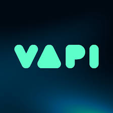

# Lets Crack It

## Description
Lets Crack It is a web application designed to facilitate interview preparation and practice. It provides users with tools to manage interviews, track progress, and connect with peers.

## Installation Instructions
1. Clone the repository:
   ```bash
   git clone https://github.com/Raghav-28/lets-crack-it.git
   ```
2. Navigate to the project directory:
   ```bash
   cd lets-crack-it
   ```
3. Install the dependencies:
   ```bash
   npm install
   ```
4. Set up Firebase configuration by adding your Firebase credentials in the appropriate files.

## Project Structure
```
letscrackit/
├── app/                  # Next.js application files
│   ├── (auth)/          # Authentication related components
│   ├── (root)/          # Root layout and pages
│   └── api/             # API routes
├── components/           # Reusable UI components
├── firebase/             # Firebase configuration and functions
├── lib/                 # Utility functions and actions
├── public/              # Static assets (images, icons)
├── styles/              # Global styles
└── README.md            # Project documentation
```

## Usage
To start the development server, run:
```bash
npm run dev
```
Visit [`http://localhost:3000`](https://letscrackit.vercel.app/) in your browser to view the application.

## Images

## Tech Stack  

 




## Key Features  
- 🎤 AI-powered mock interviews  
- 📊 Performance analytics dashboard  
- 🤖 Interactive coding challenges  
- 👥 Peer feedback system  
## Contributing
Contributions are welcome! Please open an issue or submit a pull request.

## License
This project is licensed under the MIT License.
