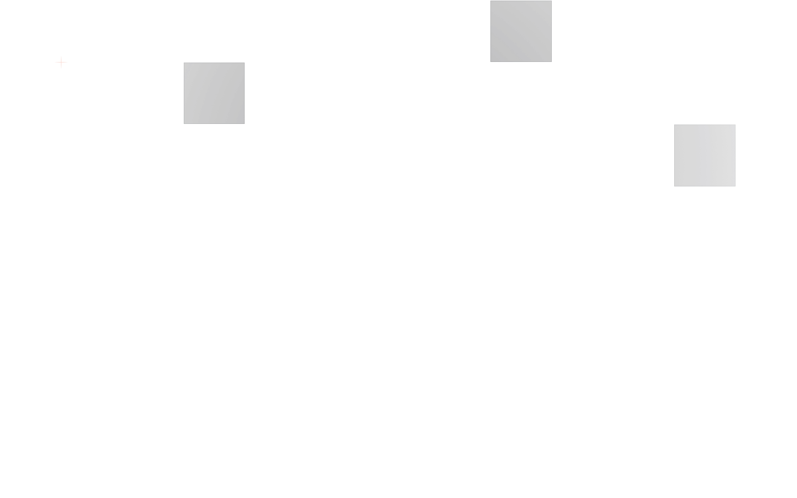
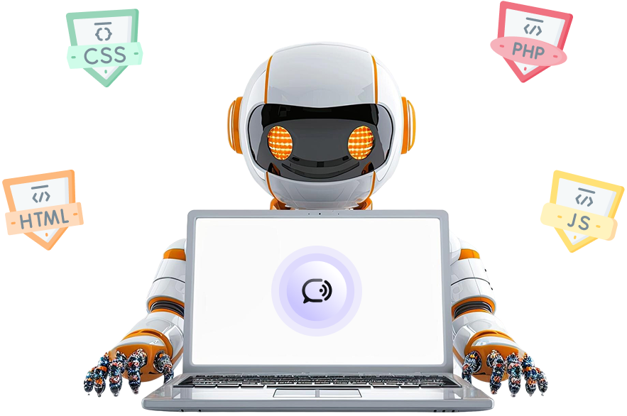

Lets Crack It


Description  
Lets Crack It is an AI-powered interview preparation platform that helps users practice technical and behavioral interview questions with realistic simulations.

Tech Stack  

 


Key Features  
- 🎤 AI-powered mock interviews  
- 📊 Performance analytics dashboard  
- 🤖 Interactive coding challenges  
- 👥 Peer feedback system  

Screenshots  




Installation  
```bash
git clone https://github.com/yourusername/lets-crack-it.git
cd lets-crack-it
npm install
npm run dev

PROJECT STRUCTURE

letscrackit/
├── app/            → Next.js application
│   ├── (auth)/     → Auth pages
│   ├── (root)/     → Main pages  
│   └── api/        → API routes
├── components/     → UI components
├── firebase/       → Firebase config
├── lib/            → Utilities
├── public/         → Assets
└── styles/         → Global CSS
